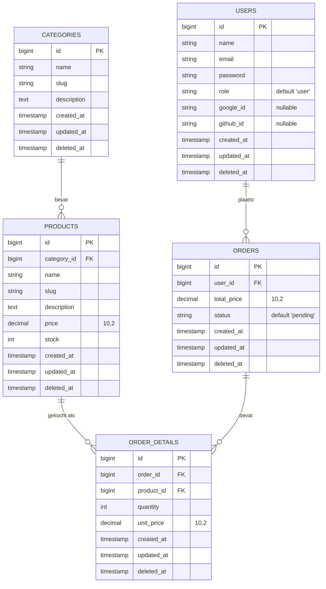

# Entity Relationship Diagram (ERD)

Hieronder bevindt zich de weergave van onze database-structuur volgens de uitgewerkte modellen in Fase 1.

```mermaid
erDiagram
    USERS {
        bigint id PK
        string name
        string email
        string password
        string role "default 'user'"
        string google_id "nullable"
        string github_id "nullable"
        timestamp created_at
        timestamp updated_at
        timestamp deleted_at
    }
    
    CATEGORIES {
        bigint id PK
        string name
        string slug
        text description
        timestamp created_at
        timestamp updated_at
        timestamp deleted_at
    }
    
    PRODUCTS {
        bigint id PK
        bigint category_id FK
        string name
        string slug
        text description
        decimal price "10,2"
        int stock
        timestamp created_at
        timestamp updated_at
        timestamp deleted_at
    }
    
    ORDERS {
        bigint id PK
        bigint user_id FK
        decimal total_price "10,2"
        string status "default 'pending'"
        timestamp created_at
        timestamp updated_at
        timestamp deleted_at
    }
    
    ORDER_DETAILS {
        bigint id PK
        bigint order_id FK
        bigint product_id FK
        int quantity
        decimal unit_price "10,2"
        timestamp created_at
        timestamp updated_at
        timestamp deleted_at
    }
    
    USERS ||--o{ ORDERS : "plaatst"
    CATEGORIES ||--o{ PRODUCTS : "bevat"
    PRODUCTS ||--o{ ORDER_DETAILS : "gekocht als"
    ORDERS ||--o{ ORDER_DETAILS : "bevat"
```
